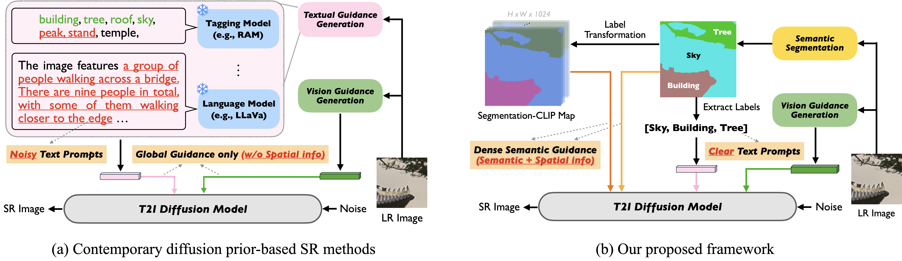

<div align=center class="logo">
    
</div>

# HoliSDiP: Image Super-Resolution via Holistic Semantics and Diffusion Prior
This is the official repository of **"HoliSDiP: Image Super-Resolution via Holistic Semantics and Diffusion Prior".**

[Li-Yuan Tsao](https://liyuantsao.github.io/), [Hao-Wei Chen](https://scholar.google.com/citations?user=cpOf3qMAAAAJ&hl=en), [Hao-Wei Chung](https://www.linkedin.com/in/haowei-chung/), [Deqing Sun](https://deqings.github.io/), [Chun-Yi Lee](https://elsalab.ai/), [Kelvin C.K. Chan](https://ckkelvinchan.github.io/), [Ming-Hsuan Yang](https://faculty.ucmerced.edu/mhyang/)

[](http://arxiv.org/abs/2411.18662)

* We also release our evaluation code at [](https://github.com/liyuantsao/SR-IQA) to facilitate fair comparisons between (real-world) image super-resolution papers.
## Overview
Existing pre-trained text-to-image diffusion model-based Real-ISR methods may produce unintended results due to noisy text prompts and their lack of spatial information. In this paper, we present HoliSDiP, a framework that leverages semantic segmentation to provide both precise textual and spatial guidance for diffusion-based Real-ISR. Our method employs semantic labels as concise text prompts while introducing dense semantic guidance through segmentation masks and our proposed Segmentation-CLIP Map, achieving significant improvement in image quality across various Real-ISR scenarios through reduced prompt noise and enhanced spatial control.



## :wrench: Dependencies and Installation
**Requirements**
* python 3.8.10
* cuda 12.1

**Dependencies**

* Basic dependency
```
# Here we use conda for example
conda create -n HoliSDiP python=3.8
conda activate HoliSDiP

pip install torch==2.3.1 torchvision==0.18.1
pip install -r requirements.txt
```

* Install detectron2 and Mask2Former (Reference: https://github.com/facebookresearch/Mask2Former)
```
# Install detectron2
git clone https://github.com/facebookresearch/detectron2.git
python -m pip install -e detectron2

# clone and install Mask2Former
git clone https://github.com/facebookresearch/Mask2Former.git
cd Mask2Former
pip install git+https://github.com/cocodataset/panopticapi.git
pip install -r requirements.txt
cd mask2former/modeling/pixel_decoder/ops
python setup.py build install
cd ../../../../..
```

## :zap: Pre-trained Models
**1. Semantic Segmentation Model**
* Install the Mask2Former semantic segmentation model from their [Model Zoo](https://github.com/facebookresearch/Mask2Former/blob/main/MODEL_ZOO.md), we use Mask2Former with Swin-L backbone, pre-trained on ADE20K dataset. [model link (install this)](https://dl.fbaipublicfiles.com/maskformer/mask2former/ade20k/semantic/maskformer2_swin_large_IN21k_384_bs16_160k_res640/model_final_6b4a3a.pkl)
* Put the model in `preset/models/mask2former`

**2. SD-2-base Model**
* Download the [SD-2-base model]((https://huggingface.co/stabilityai/stable-diffusion-2-base)) from HuggingFace.
* Put the folder `stable-diffusion-2-base` in `preset/models/`

**3. Pre-trained Image Encoder**
* We use the pre-trained DAPE encoder from SeeSR. Please download the `DAPE.pth` from their [Google Drive](https://drive.google.com/drive/folders/12HXrRGEXUAnmHRaf0bIn-S8XSK4Ku0JO) and also download the RAM model from [this link](https://huggingface.co/spaces/xinyu1205/Recognize_Anything-Tag2Text/blob/main/ram_swin_large_14m.pth).
* Put both `DAPE.pth` and `ram_swin_large_14m.pth` in `preset/models`.

**4. Download HoliSDiP Pre-trained Model**
* Please download our pre-trained model from the [Google Drive](https://drive.google.com/drive/folders/1XPp3ILAuV2cHEloq8UHIQ7B49QBz-7QK?usp=sharing).
* Put the folder `HoliSDiP` in `preset/models/`

## :rice_scene: Preparing Datasets
### Training data
* We use the [LSDIR](https://github.com/ofsoundof/LSDIR) dataset and the first 10k images from the [FFHQ](https://github.com/NVlabs/ffhq-dataset) dataset.
* Modify the `gt_path` in `dataloaders/config.yml` to the paths of these datasets.

### Testing data
* You can download the testing sets from the HuggingFace page of [StableSR](https://huggingface.co/datasets/Iceclear/StableSR-TestSets).

## :rocket: Launch Your Training
* The checkpoints will be saved at `experiments/<EXP_NAME>` by specifing the `--output_dir` argument.
```
CUDA_VISIBLE_DEVICES="0,1,2,3" accelerate launch train.py  --output_dir experiments/<EXP_NAME>  --enable_xformers_memory_efficient_attention --train_batch_size=4 --gradient_accumulation_steps=2
```

## :ferris_wheel: Run Testing
* Specify the `--image_path` argument to the path of your testing data.
* The output images will be saved at `results/<OUTPUT_DIR>/samples` by specifing the `--output_dir` argument.
* We also provide the code of saving the segmentation masks, which are stored at `results/<OUTPUT_DIR>/masks`, with `results/<OUTPUT_DIR>/masks_meta` showing the labels on the masks.
* The prompts generated by our Semantic Label-Based Prompting (SLBP) are stored at results/<OUTPUT_DIR>/masks_meta`

```
python test.py --holisdip_model_path preset/models/HoliSDiP  --image_path <TEST_IMG_PATH> --output_dir results/<OUTPUT_DIR> --save_prompts
```

## :mailbox_with_mail: Contact
If you have any question, please feel free to send message to `lytsao@gapp.nthu.edu.tw`

## :chart_with_upwards_trend: Citation
If you find our work helpful for your research, we would greatly appreciate your assistance in sharing it with the community and citing it using the following BibTex. Thank you for supporting our research.
```
@article{tsao2024holisdip,
  title={HoliSDiP: Image Super-Resolution via Holistic Semantics and Diffusion Prior},
  author={Tsao, Li-Yuan and Chen, Hao-Wei and Chung, Hao-Wei and Sun, Deqing and Lee, Chun-Yi and Chan, Kelvin CK and Yang, Ming-Hsuan},
  journal={arXiv preprint arXiv:2411.18662},
  year={2024}
}
```

## :star2: Acknowledgements
Our project is built on [SeeSR](https://github.com/cswry/SeeSR) and [Mask2Former](https://github.com/facebookresearch/Mask2Former), with some codes borrowed from [SPADE](https://github.com/NVlabs/SPADE). We appriciate their amazing works that advance this community. 
